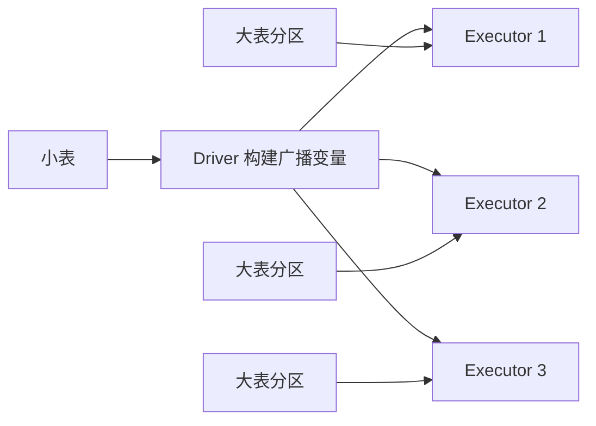

# Spark 广播 Join

## 1. 它是什么？

广播 Join 会把小表复制到每个 Executor，让大表的每个分区都可以在本地完成 Join，从而避免大表按照 Join Key 进行 Shuffle。

## 2. 它解决什么问题？

普通 Join 往往需要两侧数据按 Join Key 重新分区，数据量大时 Shuffle 成本很高。广播 Join 通过移动小表，避免移动大表，适合大表关联小维表、字典表和配置表。

## 3. 它在整个流程中的位置？

广播 Join 常出现在 DWD 明细补维、DWS 汇总前补充维度属性、ADS 指标宽表构建等场景。它是 Spark SQL 优化器选择物理计划时的一种 Join 策略。

## 4. 底层原理是什么？

Driver 会收集小表数据并构建广播变量，然后分发到各个 Executor。Executor 在处理大表分区时，把本地分区记录与广播过来的小表哈希结构进行匹配。

## 5. 典型使用场景

- 大事实表关联小维表。
- 维表数据量较小且可以放入 Executor 内存。
- 需要减少 Shuffle 和缓解 Join 倾斜。
- 某些热点 Key 只在大表侧严重倾斜，小表侧可广播。

## 6. 常见问题

广播表过大时，可能导致 Driver 收集数据压力过高或 Executor 内存不足。广播 Join 也不适合两侧都很大的 Join，不适合小表频繁变化但缓存失效成本很高的链路。

## 7. 优化方案

- 设置合理的 `spark.sql.autoBroadcastJoinThreshold`。
- 对确认为小表的数据使用 `broadcast()` 提示。
- 在广播前裁剪无用字段、过滤无效记录。
- 关注广播表大小、Driver 内存和 Executor 内存。
- 和 AQE 配合，让 Spark 在运行期选择更合适的 Join 策略。

## 8. 和其他技术的区别

| 维度 | 广播 Join | Shuffle Join |
| --- | --- | --- |
| 数据移动 | 移动小表到 Executor | 两侧按 Key Shuffle |
| 适用场景 | 大表 Join 小表 | 大表 Join 大表 |
| 性能特点 | 避免大表 Shuffle，通常更快 | 更通用，但 Shuffle 成本高 |
| 风险 | 小表过大导致内存压力 | 数据倾斜和 Shuffle 瓶颈 |

## 9. 关联知识

- [Spark 执行流程](/compute/spark-execution-flow)
- [Spark 数据倾斜](/compute/spark-skew)
- [Join 优化](/optimization/join-optimization)

## 总结输出

广播 Join 快的核心原因是用“小表复制”换“大表不 Shuffle”。它适合大表关联小表，可以显著减少网络传输和 Shuffle 落盘。但广播不是越多越好，必须控制小表大小、字段数量和内存风险。
