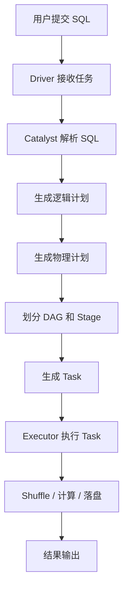
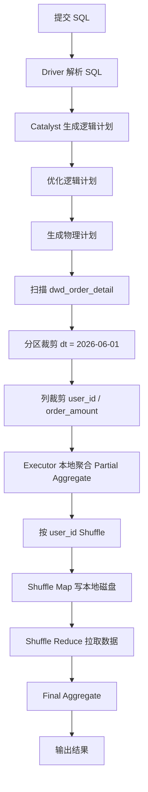

# Spark 执行流程

## 1. 它是什么？

Spark 执行流程描述的是一条 SQL 或一个 Spark 作业从提交到输出结果的完整链路。它把“写了一条 SQL”拆解为解析、优化、生成计划、划分 Stage、生成 Task、分发到 Executor、执行计算和输出结果等步骤。



## 2. 它解决什么问题？

理解执行流程可以帮助判断一个问题发生在哪里。SQL 慢、数据倾斜、Shuffle 过大、Executor OOM、Driver OOM、任务长尾等现象，本质上都可以回到 Driver、DAG、Stage、Task、Executor 和 Shuffle 的某个环节去定位。

## 3. 它在整个流程中的位置？

在大数据平台中，Spark 通常位于离线加工、湖仓数据加工、指标汇总和宽表建设环节。上游可能来自 Hive、Paimon、Kafka 落湖数据或对象存储，下游可能写入 Hive、Paimon、ClickHouse / ByteHouse、ADS 层或数据服务。

## 4. 底层原理是什么？

用户提交 SQL 后，Driver 接收任务并维护整个应用的生命周期。Spark SQL 会通过 Catalyst 解析 SQL，生成未解析逻辑计划、已解析逻辑计划、优化后的逻辑计划，再由优化器选择物理执行计划。

DAG 是 Spark 根据 RDD 或 SQL 执行计划形成的有向无环图，表示计算依赖关系。遇到 Shuffle 这类宽依赖时，Spark 会把 DAG 切分为多个 Stage。每个 Stage 内部通常是窄依赖，可以流水线执行；Stage 之间需要等待上游 Shuffle 输出完成。

Task 是 Stage 内实际执行的最小调度单元。一个 Stage 会根据分区数生成多个 Task，这些 Task 被调度到不同 Executor 上运行。Executor 负责扫描数据、执行算子、进行本地计算、读写 Shuffle 数据、缓存数据和写出结果。

Shuffle 发生在需要按 Key 重新分布数据的地方，例如 `group by`、`join`、`distinct`、`repartition`。Shuffle 会把上游 Task 的输出写到本地或远端 Shuffle 存储，再由下游 Task 拉取对应分区数据，因此它通常是性能和稳定性问题的集中点。

## 5. 典型使用场景

- 分析 Spark SQL 为什么运行缓慢。
- 判断某个 Join 是否触发了大规模 Shuffle。
- 通过 Spark UI 查看 Stage 和 Task 的耗时差异。
- 定位少数 Task 长尾、Executor OOM 或 Shuffle Read 过大的原因。
- 评估广播 Join、AQE、分区调整等优化是否有效。

## 6. 常见问题

| 问题 | 常见原因 |
| --- | --- |
| 少数 Task 特别慢 | 数据倾斜、分区数据量不均、单个 Key 过大 |
| Shuffle Read 很大 | Join 或聚合没有提前过滤，分区策略不合理 |
| Executor OOM | 单 Task 数据过大、缓存过多、Join 构建侧过大 |
| Driver OOM | 收集过多结果到 Driver，任务元数据或分区数过多 |

## 7. 优化方案

- 在 SQL 入口减少无效数据，尽早过滤和裁剪字段。
- 优先确认执行计划，判断是否发生了不必要的 Shuffle。
- 对小维表使用广播 Join，减少大表 Shuffle。
- 对倾斜 Key 使用加盐、拆分大 Key 或 AQE skew join。
- 控制分区数，避免 Task 太少导致单 Task 数据过大，也避免 Task 太多造成调度压力。

## 8. 和其他技术的区别

Spark 更适合大规模批处理和复杂 SQL 加工。Flink 更偏流式状态计算和低延迟处理。ClickHouse / ByteHouse 更适合面向查询服务的高并发 OLAP。Paimon 则是湖仓表格式，负责组织数据文件、增量变更、快照和元数据。

## SQL 示例：一条 GROUP BY 是怎么执行的？

下面这条 SQL 用于统计 2026-06-01 每个用户的订单数和订单金额：

```sql
SELECT
    user_id,
    COUNT(*) AS order_cnt,
    SUM(order_amount) AS total_amount
FROM dwd_order_detail
WHERE dt = '2026-06-01'
GROUP BY user_id;
```

它的执行流程可以拆成下面几步：

1. Driver 接收 SQL。
2. Catalyst 解析 SQL，生成逻辑计划。
3. 优化器进行谓词下推和列裁剪。
4. 扫描 `dwd_order_detail` 表，只读取 `user_id`、`order_amount`、`dt` 相关列。
5. 根据 `dt = '2026-06-01'` 做分区裁剪。
6. Executor 并行读取不同文件分片。
7. 每个 Executor 先做本地聚合，也就是 Partial Aggregate。
8. 因为 `GROUP BY user_id`，需要按 `user_id` 重新分区，触发 Shuffle。
9. Shuffle Map 阶段将中间结果写入本地磁盘。
10. Shuffle Reduce 阶段拉取对应分区数据。
11. Reduce 端完成 Final Aggregate。
12. 结果返回 Driver 或写入目标表。



## 这条 SQL 如何划分 Stage？

这条 SQL 至少会被划分为两个 Stage。

### Stage 1：扫描 + 过滤 + 本地聚合 + Shuffle Write

主要执行：

1. 扫描 `dwd_order_detail` 表。
2. 根据 `dt = '2026-06-01'` 做分区裁剪。
3. 只读取 `user_id` 和 `order_amount` 等必要字段。
4. 在每个 Executor 内部做 Partial Aggregate。
5. 按 `user_id` 进行 Shuffle 分区。
6. 将 Shuffle 中间数据写入本地磁盘。

### Stage 2：Shuffle Read + 全局聚合 + 输出

主要执行：

1. 每个 Reduce Task 从多个 Executor 拉取属于自己分区的数据。
2. 对相同 `user_id` 的数据进行 Final Aggregate。
3. 输出最终结果。

### 为什么这里会切分 Stage？

因为 `GROUP BY user_id` 需要让相同 `user_id` 的数据进入同一个 Reduce Task。这个过程需要跨 Executor 重新分发数据，也就是 Shuffle。Spark 通常会以 Shuffle 为边界切分 Stage。

## 这条 SQL 哪些地方可能会落盘？

### 1. Shuffle Write 落盘

在 Stage 1 中，Map Task 会把按照 `user_id` 分区后的中间数据写到 Executor 本地磁盘上。这个过程就是 Shuffle Write。

### 2. Shuffle Read 临时数据落盘

在 Stage 2 中，Reduce Task 会从多个 Executor 拉取 Shuffle 数据。如果拉取的数据量较大，内存放不下，可能会发生溢写，也就是 spill 到磁盘。

### 3. 聚合过程中内存不足导致落盘

如果某个 Task 中需要聚合的 key 特别多，聚合 hash map 占用内存过高，也可能发生 spill。

### 4. 输出结果落盘

如果 SQL 是 `INSERT OVERWRITE` 或 `INSERT INTO`，最终结果会写入目标表，例如 Hive、Paimon、HDFS 或 OSS。

## INSERT 写出示例

```sql
INSERT OVERWRITE TABLE ads_user_order_summary PARTITION (dt = '2026-06-01')
SELECT
    user_id,
    COUNT(*) AS order_cnt,
    SUM(order_amount) AS total_amount
FROM dwd_order_detail
WHERE dt = '2026-06-01'
GROUP BY user_id;
```

相比普通 SELECT，这条 SQL 最后多了一步结果写出。最终结果会由 Executor 写入目标表分区：

```text
ads_user_order_summary/dt=2026-06-01
```

如果目标表是 Paimon，还会涉及文件写入、快照提交、元数据更新等过程。也就是说，普通 SELECT 的结果可以返回 Driver 或展示给调用方，而 INSERT 类 SQL 会把最终结果持久化到目标表。

## 9. 关联知识

- [Spark 数据倾斜](/compute/spark-skew)
- [Spark Shuffle](/compute/spark-shuffle)
- [Spark 广播 Join](/compute/spark-broadcast-join)
- [Spark SQL 运行缓慢排查](/cases/spark-slow-sql)

## 总结输出

Spark 执行流程可以概括为：SQL 进入 Driver，Catalyst 生成执行计划，DAG 按 Shuffle 边界切分 Stage，Stage 生成 Task，Task 在 Executor 上扫描、计算、Shuffle 和写出结果。理解这条链路后，性能问题就不再是模糊的“SQL 慢”，而是可以定位到计划、Stage、Task、Shuffle 或资源的具体问题。
