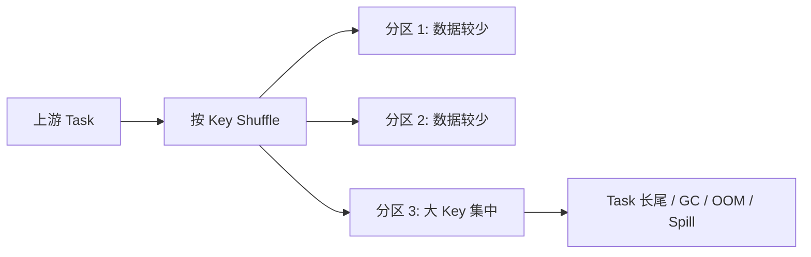

# Spark 数据倾斜

## 1. 它是什么？

Spark 数据倾斜的本质是 Shuffle 后数据分布不均。某些 Key 或某些分区的数据量远大于其他分区，导致少数 Task 执行时间极长，甚至引发 Executor OOM、频繁 GC 或大量 spill。

::: tip 提示
不是所有 SQL 慢都是数据倾斜。数据倾斜通常表现为少数 Task 明显慢于其他 Task，并且这些 Task 的 Shuffle Read、spill、GC Time 等指标明显偏高。
:::

## 2. 它解决什么问题？

理解数据倾斜是为了把“任务卡住”“少数 Task 很慢”“资源看起来够但作业跑不完”这类问题从现象还原为数据分布问题。只有定位到倾斜 Stage、倾斜算子和倾斜 Key，优化才有方向。

## 3. 它在整个流程中的位置？

数据倾斜通常发生在需要按 Key 重新分发数据的 Shuffle 阶段，例如 `group by`、`join`、`distinct`、`repartition`。在湖仓加工中，倾斜经常出现在明细层聚合、宽表 Join、指标汇总和大 Key 维度补全场景。

## 4. 底层原理是什么？

Shuffle 会按照分区器把相同 Key 或同一分区范围的数据发送到同一个 Reduce 端 Task。如果某个 Key 的数据量特别大，它对应的 Reduce Task 会读取远超其他 Task 的 Shuffle 数据，形成长尾。



## 5. 典型使用场景

- `group by user_id` 或 `group by city_id` 时少数 Key 数据量极大。
- 大表 Join 维表时存在空值、默认值或热点 Key。
- `distinct` 对低基数字段去重，数据集中到少量 Key。
- `repartition(key)` 后某些分区数据明显偏大。

### group by 倾斜示例

```sql
SELECT
    city_id,
    COUNT(*) AS order_cnt
FROM dwd_order_detail
WHERE dt = '2026-06-01'
GROUP BY city_id;
```

示例数据分布：

| city_id | 数据量 |
| --- | ---: |
| 1 | 8000 万行 |
| 2 | 100 万行 |
| 3 | 80 万行 |
| 4 | 50 万行 |
| 其他 city_id | 每个几万行 |

这条 SQL 会按照 `city_id` 做 Shuffle。如果 `city_id = 1` 的数据量特别大，那么所有 `city_id = 1` 的数据最终会进入同一个或少数几个 Reduce Task，导致这些 Task 的 Shuffle Read 数据量远大于其他 Task。

最终表现为：

1. 大部分 Task 很快完成。
2. 少数 Task 长时间运行。
3. Spark UI 中某些 Task 的 Shuffle Read 明显高于其他 Task。
4. 这些 Task 可能出现 GC 时间高、spill 数据量大、甚至 Executor OOM。

### Join 倾斜示例

```sql
SELECT
    a.user_id,
    a.order_id,
    b.user_level
FROM dwd_order_detail a
LEFT JOIN dim_user b
ON a.user_id = b.user_id
WHERE a.dt = '2026-06-01';
```

示例数据分布：

| user_id | 数据量 |
| --- | ---: |
| 0 或 unknown | 3000 万行 |
| 其他 user_id | 分布较均匀 |

如果 `user_id = 0` 或 `unknown` 是默认值、异常值或未登录用户标识，那么大量订单都会集中在这个 key 上。普通 Shuffle Join 会按照 `user_id` 对两张表重新分区，相同的 `user_id` 会进入同一个 Reduce Task。因此，`user_id = 0` 对应的数据会集中到某个 Task，导致该 Task 处理的数据量远大于其他 Task。

## 6. 常见问题

典型现象包括少数 Task 很慢、Shuffle Read 特别大、Executor OOM、GC 时间高、Stage 长时间停留在最后几个 Task。排查时应先看 Spark UI 的 Stage 页面，比较 Task 的 Duration、Shuffle Read Size、Spill、GC Time 和 Input Size。

## Spark UI 中怎么看数据倾斜？

重点看 Stage 页面中的 Task 指标。

### 1. Duration

如果大部分 Task 几十秒完成，但少数 Task 运行几分钟甚至更久，说明可能存在长尾 Task。

### 2. Shuffle Read Size

如果某几个 Task 的 Shuffle Read 明显高于其他 Task，说明这些 Task 拉取的数据量过大，可能存在 Shuffle 后数据倾斜。

### 3. Spill Memory / Spill Disk

如果某些 Task 出现大量 spill，说明内存中放不下中间数据，被迫溢写到磁盘。

### 4. GC Time

如果某些 Task 的 GC Time 很高，说明 Executor 内存压力大，可能和大 key、聚合状态过大、Join 数据量过大有关。

### 5. Input Size

如果扫描阶段个别 Task 的 Input Size 明显偏大，可能不是 Shuffle 倾斜，而是文件分布不均或小文件 / 大文件问题。

## 怎么判断是不是数据倾斜？

可以按照下面方式判断：

```text
少数 Task 特别慢
+
这些 Task 的 Shuffle Read 特别大
+
SQL 中存在 group by / join / distinct / repartition
=
大概率是 Shuffle 数据倾斜
```

如果是所有 Task 都慢，更可能是数据量大、资源不足、SQL 本身复杂、扫描文件多或外部存储慢。

如果是扫描阶段少数 Task Input Size 特别大，更可能是文件分布不均，而不是典型 Shuffle 倾斜。

## 7. 优化方案

| 方案 | 适用场景 | 代价 |
| --- | --- | --- |
| 过滤异常 Key | 空值、默认值、脏数据造成倾斜 | 需要确认过滤不会影响业务结果 |
| 小表广播 | 一侧表足够小 | 小表过大可能造成 Executor 内存压力 |
| 加盐 | 大 Key 聚合或 Join | SQL 复杂度上升，结果需要二次聚合或维表膨胀 |
| 大 Key 单独处理 | 少量热点 Key 特别大 | 需要拆分链路，维护成本更高 |
| AQE skew join | Spark 版本和配置支持 | 对所有场景不一定稳定生效 |
| 调整并行度 | 单分区数据过大 | 并行度过高会增加调度和小文件压力 |

### 过滤异常 key

```sql
SELECT
    a.user_id,
    a.order_id,
    b.user_level
FROM dwd_order_detail a
LEFT JOIN dim_user b
ON a.user_id = b.user_id
WHERE a.dt = '2026-06-01'
  AND a.user_id IS NOT NULL
  AND a.user_id <> '0'
  AND a.user_id <> 'unknown';
```

如果 `user_id = 0` 或 `unknown` 本身没有分析价值，可以在 Join 前过滤掉。这是成本最低的优化方式。但如果这些数据仍然有业务价值，不能直接过滤，就需要考虑大 key 单独处理或加盐打散。

### 大 key 单独处理

```sql
-- 普通 key
SELECT
    a.user_id,
    a.order_id,
    b.user_level
FROM dwd_order_detail a
LEFT JOIN dim_user b
ON a.user_id = b.user_id
WHERE a.dt = '2026-06-01'
  AND a.user_id NOT IN ('0', 'unknown')
UNION ALL
-- 热点 key 单独处理
SELECT
    a.user_id,
    a.order_id,
    'unknown_level' AS user_level
FROM dwd_order_detail a
WHERE a.dt = '2026-06-01'
  AND a.user_id IN ('0', 'unknown');
```

这个方案的思路是：普通 key 走正常 Join，热点 key 单独处理，避免参与 Shuffle Join，最后通过 `UNION ALL` 合并结果。它适合热点 key 可以用特殊规则处理的场景。

### 加盐打散

```sql
WITH fact_salted AS (
    SELECT
        *,
        CAST(rand() * 10 AS INT) AS salt
    FROM dwd_order_detail
    WHERE dt = '2026-06-01'
),
dim_expanded AS (
    SELECT
        user_id,
        user_level,
        salt
    FROM dim_user
    LATERAL VIEW explode(array(0,1,2,3,4,5,6,7,8,9)) t AS salt
)
SELECT
    a.user_id,
    a.order_id,
    b.user_level
FROM fact_salted a
LEFT JOIN dim_expanded b
ON a.user_id = b.user_id
AND a.salt = b.salt;
```

加盐的核心是把原来集中在一个 key 上的数据打散成多个 key。例如 `user_id = 0` 被打散成 `0_0`、`0_1`、`0_2` 等多个组合，让原本进入一个 Reduce Task 的数据拆到多个 Reduce Task 中处理。

代价是 SQL 复杂度上升，维表需要膨胀，数据量会变大，salt 数量也需要根据数据量调试。

## 8. 和其他技术的区别

Flink 也会遇到 Key 分布不均，但它更常表现为某些 Subtask 背压或状态过大。ClickHouse / ByteHouse 的倾斜更多体现在分片、分区、主键和数据跳过索引效果上。Spark 的倾斜常与 Shuffle、Reduce 端聚合和 Join 分布直接相关。

## 9. 关联知识

- [Spark 执行流程](/compute/spark-execution-flow)
- [Spark Shuffle](/compute/spark-shuffle)
- [小表广播 Join](/compute/spark-broadcast-join)
- [Executor OOM](/optimization/executor-oom)
- [GC 问题](/optimization/gc)

## 总结输出

数据倾斜不是简单的资源不足，而是 Shuffle 后数据没有均匀分布。排查时先定位倾斜 Stage，再看 Task 的 Duration、Shuffle Read、Spill 和 GC Time，然后找到倾斜算子和倾斜 Key。优化时要根据业务语义选择过滤、广播、加盐、大 Key 单独处理、AQE 或并行度调整，每种方案都要同时评估结果正确性、性能收益和维护成本。
