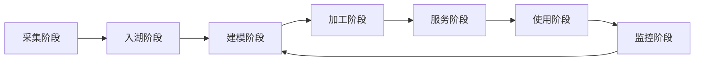

# 数据治理流程

## 1. 它是什么？

数据治理是贯穿数据采集、入湖、建模、加工、服务、使用、监控全过程的一套规则、流程和能力。它让数据可发现、可理解、可追踪、可校验、可授权、可控成本。

## 2. 它解决什么问题？

没有治理的数据平台会逐渐出现口径不一致、表没人敢用、质量问题难追溯、权限边界不清、任务成本失控等问题。治理的目标不是增加流程负担，而是让数据资产长期可信和可复用。

## 3. 它在整个流程中的位置？

数据治理不是单独的最后一步，而是嵌入采集、入湖、建模、加工、服务、使用和监控的每个环节。

## 4. 底层原理是什么？

采集阶段治理关注数据来源、字段含义、采集规范和变更通知。入湖阶段治理关注表命名、分区、主键、去重、延迟和原始数据可回放。建模阶段治理关注数据域、分层规范、指标口径、维度一致性和公共模型沉淀。

加工阶段治理关注任务依赖、质量校验、血缘关系、重跑影响和产出 SLA。服务阶段治理关注 ADS 表、接口、BI 数据集和查询性能。使用阶段治理关注权限、脱敏、审计和数据解释。监控阶段治理关注质量波动、任务失败、成本异常、存储增长和链路告警。

## 5. 典型使用场景

- 新增数据源时登记来源、负责人和字段含义。
- Paimon 或 Hive 表入湖时校验分区、主键和延迟。
- 构建 DWD、DWS、ADS 时统一口径和命名规范。
- 指标异常时通过血缘追踪上游表和任务。
- 对敏感字段做权限控制、脱敏和访问审计。
- 周期性清理低价值表和高成本任务。

## 6. 常见问题

| 阶段 | 治理重点 |
| --- | --- |
| 采集阶段 | 数据源、字段标准、采集完整性 |
| 入湖阶段 | 表规范、分区、主键、延迟、重复数据 |
| 建模阶段 | 数据域、分层、指标口径、维度一致性 |
| 加工阶段 | 任务依赖、血缘、质量校验、重跑影响 |
| 服务阶段 | 查询性能、服务 SLA、数据集口径 |
| 使用阶段 | 权限、脱敏、审计、说明文档 |
| 监控阶段 | 质量波动、成本异常、任务失败、告警 |

## 7. 优化方案

- 为每张核心表维护负责人、业务含义、生命周期和使用范围。
- 在采集和入湖阶段设置完整性、唯一性和延迟校验。
- 为核心指标建立口径文档和血缘链路。
- 把质量校验嵌入 DolphinScheduler 等调度流程。
- 对高成本任务建立资源、扫描量和产出价值评估。
- 对敏感数据设置分级、授权、脱敏和审计策略。

## 8. 和其他技术的区别

元数据管理、血缘分析、质量校验、权限治理和成本治理是数据治理的不同切面。元数据解决“数据是什么”，血缘解决“数据从哪里来到哪里去”，质量解决“数据是否可信”，权限解决“谁能用”，成本解决“是否值得这样用”。

## 9. 关联知识

- [元数据管理](/governance/metadata)
- [血缘分析](/governance/lineage)
- [数据质量](/governance/quality)
- [成本治理](/governance/cost)
- [数据治理流程问题](/questions/data-governance-flow)

## 总结输出

数据治理贯穿数据平台全流程。它不是独立文档，也不是只在出问题时补救，而是通过元数据、血缘、质量、权限和成本机制，让数据从采集到使用始终可解释、可追踪、可信任、可控制。
