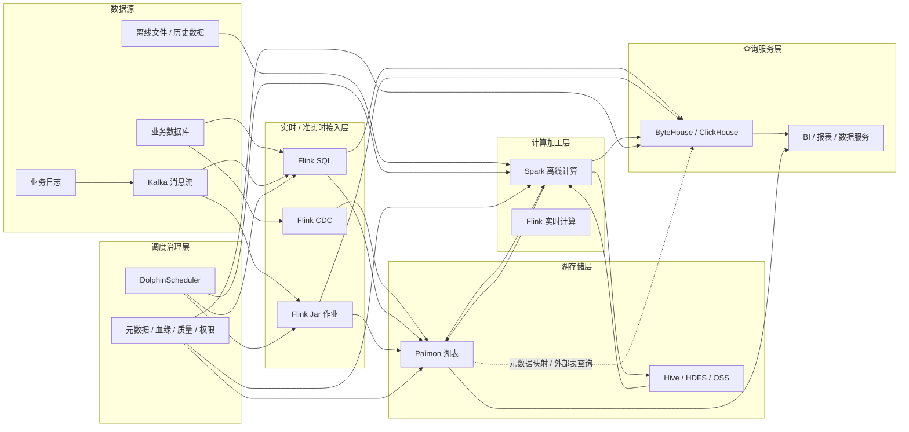

# Kafka + Flink + Paimon + Spark + ByteHouse 湖仓一体架构

## 1. 它是什么？

这是一套多链路并存的湖仓一体架构，不是“业务数据库 → Flink CDC → Kafka → Paimon → Spark → ByteHouse”的单一路径。业务数据库、Kafka 消息流、业务日志和离线文件可以分别通过 Flink CDC、Flink SQL、Flink Jar、Spark 等方式进入 Paimon、Hive / HDFS / OSS 或 ByteHouse / ClickHouse。

::: warning 注意
湖仓一体架构不是单一链路。Kafka 消息流可以通过 Flink SQL 或 Flink Jar 写入 Paimon，也可以直接写入 ByteHouse。ByteHouse 的数据既可以来自 Spark 离线加工，也可以来自 Flink 实时写入，还可以通过外部表或 Catalog 查询湖上数据。
:::

## 2. 它解决什么问题？

传统数仓往往把实时链路、离线链路和查询链路分散建设，导致数据多份复制、口径难统一、链路难追踪。湖仓一体要解决的是统一存储、统一元数据、多引擎计算和治理闭环的问题，但这不代表所有数据都必须先进入某一个固定组件。

更准确地说，Paimon 承担湖存储和流批表格式能力，Spark 承担离线加工和复杂 SQL，Flink 承担实时接入和实时计算，ByteHouse / ClickHouse 承担高性能 OLAP 查询和服务层存储，DolphinScheduler 和治理能力负责让链路可调度、可追踪、可校验。

## 3. 它在整个流程中的位置？

这套架构覆盖采集、入湖、加工、查询、调度和治理：

- 业务数据库可以通过 Flink CDC 捕获 Binlog，也可以通过 Flink SQL / Flink Jar 做实时接入。
- Kafka 消息流通常由 Flink SQL / Flink Jar 消费，经过清洗、转换、聚合后写入 Paimon、ByteHouse 或其他存储。
- 离线文件和历史数据通常由 Spark 读取 Hive、HDFS、OSS 或 Paimon，再加工生成 DWD、DWS、ADS。
- ByteHouse / ClickHouse 可以承接 Flink 直写、Spark 离线写入、外部表查询或批量同步数据。

## 4. 底层原理是什么？

### 架构说明

这套架构不是单一路径的数据流，而是多条链路并存的湖仓一体架构。

Kafka 消息流通常不会直接进入数据湖或数仓，而是通过 Flink SQL 或 Flink Jar 作业进行清洗、转换、聚合后，再写入 Paimon、ByteHouse 或其他存储。

ByteHouse / ClickHouse 也不是只查询 Spark 加工后的数据。它的数据来源可以包括：

1. Flink SQL 直接写入的实时明细或聚合数据。
2. Flink Jar 作业写入的实时数据。
3. Spark 离线加工后写入的宽表或指标表。
4. 通过 Paimon Catalog、外部表或元数据映射方式读取湖上数据。
5. 其他离线导入或批量同步的数据。

因此，ByteHouse 在架构中既可以作为高性能查询引擎，也可以作为独立的 OLAP 存储服务层，而不只是 Spark 的下游查询层。

### ByteHouse 数据来源

| 数据来源 | 说明 |
| --- | --- |
| Flink SQL 直接写入 | 适合实时明细、实时聚合、看板数据 |
| Flink Jar 实时写入 | 适合复杂实时处理逻辑和定制 Sink |
| Spark 离线加工后写入 | 适合 DWS、ADS、宽表和指标表 |
| Paimon 元数据映射读取湖表 | 适合通过 Catalog 或外部表查询湖上数据 |
| 离线导入或批量同步 | 适合历史数据初始化、周期同步或服务层补数 |

## 5. 典型使用场景

- 业务数据库变更通过 Flink CDC 写入 Paimon，沉淀可回溯的湖表。
- Kafka 行为日志通过 Flink SQL 清洗后，同时写入 Paimon 明细层和 ByteHouse 实时看板表。
- Spark 读取 Paimon / Hive / HDFS / OSS，离线加工生成 DWD / DWS / ADS。
- Spark 将稳定高频查询的 ADS 宽表写入 ByteHouse，支撑 BI 和数据服务。
- ByteHouse 通过外部表或 Catalog 查询湖上数据，同时也保留自己的高性能存储。

## 6. 常见问题

### 容易误解的点

#### 误解一：Kafka 数据一定通过 Flink CDC 入湖

不准确。

Flink CDC 主要用于捕获数据库 Binlog 变更，例如 MySQL、PostgreSQL 等数据库的增量变更。Kafka 本身是消息队列或日志流，通常通过 Flink SQL 或 Flink Jar 消费，再写入 Paimon、ByteHouse 或其他存储。

#### 误解二：ByteHouse 的数据都来自 Spark

不准确。

ByteHouse 的数据可以来自 Spark 离线写入，也可以来自 Flink SQL / Flink Jar 实时写入，还可以通过外部表或 Catalog 查询湖上的数据。

#### 误解三：湖仓一体就是所有数据都必须先进 Paimon

不准确。

Paimon 是湖存储层的重要组成，但不是所有数据都必须先进入 Paimon。对于实时看板、高频查询、低延迟分析场景，数据可以由 Flink 直接写入 ByteHouse。

#### 误解四：存算分离等于查询引擎不存数据

不准确。

存算分离强调存储层和计算层解耦，但并不代表所有查询引擎都不保留自己的存储。ByteHouse / ClickHouse 本身也可以存储数据，同时也可以通过外部表或 Catalog 查询外部湖表。

## 7. 优化方案

- 按数据链路区分实时明细、湖表沉淀、离线加工和查询服务，不把所有数据流强行收敛到单一路径。
- 对 Paimon 表设计主键、分区、bucket、文件合并和快照保留策略。
- 对 ByteHouse / ClickHouse 表设计分区键、排序键、导入方式和冷热生命周期。
- 将低延迟查询和高并发查询放到 OLAP 服务层，把复杂加工放到 Spark 或 Flink。
- 建立元数据、血缘、质量、权限和成本治理，明确每条链路的数据来源和责任边界。

## 8. 和其他技术的区别

单独使用 Hive 更偏离线数仓，实时更新和多引擎增量消费能力较弱。单独使用 Kafka 只解决流转，不解决长期存储和建模。单独使用 ByteHouse / ClickHouse 查询很快，但不适合作为全量明细湖存储和复杂加工中心。湖仓一体强调的不是某一个组件，而是开放存储、表格式、多引擎计算、服务层查询和治理能力的组合。

## 9. 关联知识

- [为什么选择 Paimon](/lakehouse/paimon-reason)
- [存算分离](/lakehouse/storage-compute-separation)
- [元数据映射](/lakehouse/metadata-mapping)
- [Spark 执行流程](/compute/spark-execution-flow)
- [ClickHouse / ByteHouse](/compute/clickhouse-bytehouse)
- [数据治理流程](/governance/)

## 总结输出

Kafka + Flink CDC + Flink SQL / Flink Jar + Paimon + Spark + ByteHouse + DolphinScheduler 的关系应理解为多链路协同，而不是单向管道。Paimon 负责湖表沉淀和流批读写，Spark 负责离线加工，Flink 负责实时接入和实时计算，ByteHouse / ClickHouse 既可以承接实时或离线写入，也可以通过外部表或 Catalog 查询湖上数据。严谨表达组件边界，才能避免把湖仓一体误解为“所有数据都先进 Paimon，再由 Spark 写给 ByteHouse”。
