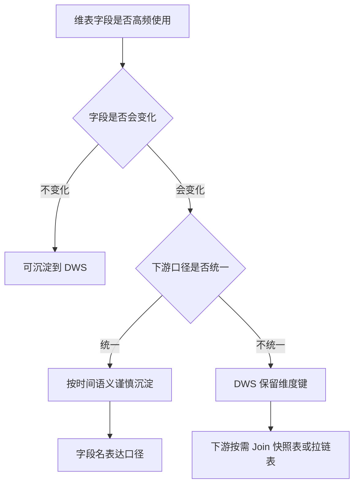

# 变化维表字段要不要沉淀到 DWS？

## 结论先行

会变化的维表字段即使经常使用，也不一定直接沉淀到 DWS。关键要看这个字段的统计口径是否统一，以及是否会影响历史统计结果。

| 判断场景 | 建议 |
| --- | --- |
| 稳定字段 | 可以沉淀到 DWS |
| 变化字段且口径统一 | 可以谨慎沉淀，字段名必须体现时间语义 |
| 变化字段且口径不一致 | 不建议写入公共 DWS，DWS 保留维度键 |
| 只服务单个业务应用 | 更适合沉淀到 ADS |

决策流程可以这样判断：



## 1. DWS 层的定位

DWS 层是公共汇总层，核心目标是：

```text
复用稳定统一口径
减少重复计算
支撑多个 ADS / BI / 数据服务
```

所以 DWS 中沉淀的字段应该具备公共复用价值，并且口径稳定。不能因为某个维度字段“经常被 Join”，就直接把它写进公共 DWS。

## 2. 稳定字段和变化字段的区别

维度字段可以分为两类。

| 类型 | 示例 | 特点 |
| --- | --- | --- |
| 稳定维度字段 | 注册渠道、注册日期、性别、首次下单日期 | 变化少，或者天然就是历史固定属性 |
| 变化维度字段 | 用户等级、会员状态、城市、风控等级、门店归属、商品类目 | 会随时间变化，容易产生历史口径歧义 |

稳定字段沉淀到 DWS 后，通常不会造成历史口径混乱。

变化字段则必须先回答一个问题：

```text
历史事实应该按照当时的维度状态统计，
还是按照当前最新维度状态统计？
```

例如用户等级变化：

```text
2026-06-01：普通用户
2026-06-10：VIP
2026-06-20：SVIP
```

用户在 `2026-06-05` 有一笔订单。

如果按历史口径统计，这笔订单应该归到“普通用户”。如果按当前口径统计，这笔订单会归到“SVIP”。两种结果都有业务意义，但含义完全不同。

## 3. 常见发生场景

这个问题通常出现在公共汇总层设计和查询性能优化之间的取舍中。

常见场景包括：

1. DWS 汇总表需要经常关联用户维表。
2. 下游报表频繁按用户等级、城市、会员状态统计。
3. 维表字段变化频繁。
4. 公共 DWS 表被多个 ADS 或 BI 复用。
5. 下游为了减少 Join，希望把维度字段提前冗余到 DWS。
6. 历史报表和当前画像分析使用同一个字段，但口径不同。
7. 维表存在一对多或多版本，Join 后可能导致数据膨胀。

例如 DWS 表：

```text
dws_user_trade_1d
dt
user_id
pay_amount_1d
order_cnt_1d
```

下游经常需要按用户等级统计 GMV：

```sql
SELECT
    user_level,
    sum(pay_amount_1d) AS gmv
FROM dws_user_trade_1d d
LEFT JOIN dim_user u
ON d.user_id = u.user_id
GROUP BY user_level;
```

这时就会有人考虑是否把 `user_level` 提前沉淀到 DWS。但如果 `user_level` 会变化，就必须明确它是当前用户等级、当天用户等级，还是交易发生时用户等级。

## 4. 排查方式

判断是否应该沉淀到 DWS，可以按以下几个问题排查。

### 4.1 看字段是否变化

检查维表历史数据：

```sql
SELECT
    user_id,
    count(DISTINCT user_level) AS level_cnt
FROM dim_user_history
GROUP BY user_id
HAVING count(DISTINCT user_level) > 1;
```

如果大量用户的字段值会变化，说明这是变化维度。

### 4.2 看下游使用频率

通过血缘和 SQL 使用情况确认：

```text
哪些 ADS 表使用了这个字段？
哪些 BI 报表按这个字段统计？
这个字段是否每天都被 Join？
是否多个团队复用？
```

如果只是少数报表使用，不一定要沉淀到公共 DWS。

### 4.3 看下游口径是否一致

需要确认下游到底使用哪种口径：

```text
按当前状态看历史
按事实发生当天状态统计
按事实发生时刻状态统计
```

如果不同下游口径不一致，不适合沉淀到公共 DWS。

### 4.4 看维表粒度是否唯一

检查维表是否一主键一行：

```sql
SELECT
    user_id,
    count(*) AS cnt
FROM dim_user
GROUP BY user_id
HAVING count(*) > 1;
```

如果维表主键不唯一，直接 Join 到 DWS 可能导致数据膨胀。

### 4.5 看 Join 成本是否高

如果下游每天都重复 Join 大维表，并且性能压力明显，可以考虑在 DWS 或 ADS 中冗余。但前提仍然是口径明确。

## 5. 四种解决方案

### 方案一：稳定字段沉淀到 DWS

适合字段：

```text
注册渠道
注册日期
首次下单日期
固定业务归属
```

示例：

```text
dws_user_trade_1d
dt
user_id
register_channel
pay_amount_1d
order_cnt_1d
```

优点是减少下游重复 Join、统一口径、提升查询性能。

### 方案二：变化字段按历史口径沉淀到 DWS

如果业务统一要求按当天状态统计，可以沉淀历史快照字段。

示例：

```text
dws_user_trade_1d
dt
user_id
user_level_at_day
city_at_day
pay_amount_1d
order_cnt_1d
```

字段命名必须体现时间语义。

推荐命名：

```text
user_level_at_day
member_status_at_day
city_at_day
```

不推荐命名：

```text
user_level
city
status
```

因为这些名字容易被误解成当前最新状态。

### 方案三：DWS 保留维度键，下游按需 Join

如果不同下游口径不一致，DWS 保持通用：

```text
dws_user_trade_1d
dt
user_id
pay_amount_1d
order_cnt_1d
```

下游要当前状态：

```sql
SELECT
    u.user_level,
    sum(d.pay_amount_1d) AS gmv
FROM dws_user_trade_1d d
LEFT JOIN dim_user_current u
ON d.user_id = u.user_id
GROUP BY u.user_level;
```

下游要当天状态：

```sql
SELECT
    u.user_level,
    sum(d.pay_amount_1d) AS gmv
FROM dws_user_trade_1d d
LEFT JOIN dim_user_df u
ON d.user_id = u.user_id
AND d.dt = u.dt
GROUP BY u.user_level;
```

下游要事实发生时状态：

```sql
SELECT
    u.user_level,
    sum(f.pay_amount) AS gmv
FROM dwd_order_detail f
LEFT JOIN dim_user_zipper u
ON f.user_id = u.user_id
AND f.pay_time >= u.start_time
AND f.pay_time < u.end_time
GROUP BY u.user_level;
```

### 方案四：在 ADS 层沉淀应用口径

如果某个变化字段只服务特定应用，不建议污染公共 DWS，可以在 ADS 中沉淀。

例如：

```text
ads_trade_by_current_user_level_1d
dt
current_user_level
gmv
order_cnt
pay_user_cnt
```

或者：

```text
ads_trade_by_user_level_at_day_1d
dt
user_level_at_day
gmv
order_cnt
pay_user_cnt
```

DWS 保持通用，ADS 固化具体业务口径。

## 6. 方案代价

| 选择 | 代价 |
| --- | --- |
| 沉淀到 DWS | DWS 表字段变多，模型变重 |
| 沉淀到 DWS | 维度变化后可能需要回刷历史数据 |
| 沉淀到 DWS | 字段口径不清晰时容易造成历史统计错误 |
| 沉淀到 DWS | 如果维表主键不唯一，可能导致 Join 膨胀 |
| 不沉淀到 DWS | 下游需要重复 Join 维表 |
| 不沉淀到 DWS | 查询性能可能变慢 |
| 不沉淀到 DWS | 多个下游可能重复实现同一套 Join 逻辑 |

选择时要平衡：

```text
口径稳定性
复用价值
查询性能
维护成本
历史可追溯
```

## 7. 关联知识

- [ODS / DWD / DWS / ADS](/modeling/ods-dwd-dws-ads)
- [维度建模](/modeling/dimension-modeling)
- [宽表设计](/modeling/wide-table)
- [Join 后数据量暴增排查](/cases/join-data-explosion)
- [数据治理怎么落地推进？](/governance/data-governance-process)

常见维表形态：

| 维表形态 | 示例字段 | 适用场景 |
| --- | --- | --- |
| 最新快照维表 | `dim_user_current(user_id, user_level, city, status, update_time)` | 当前状态分析 |
| 每日快照维表 | `dim_user_df(dt, user_id, user_level, city, status)` | 按天还原历史状态 |
| 拉链维表 | `dim_user_zipper(user_id, user_level, city, status, start_time, end_time, is_current)` | 精确还原事实发生时状态 |

## 总结输出

会变化的维表字段即使经常使用，也不一定直接沉淀到 DWS。关键要看统计口径是否统一，以及是否会影响历史结果。

如果字段稳定，或者变化字段的口径已经统一，并且多个下游高频使用，可以沉淀到 DWS，但字段名必须表达清楚时间语义，例如 `user_level_at_day`、`city_at_day`，避免和当前最新状态混淆。

如果不同下游口径不一致，比如有的看当前状态，有的看历史状态，有的看事实发生时状态，就不建议把这个字段直接写入公共 DWS。更稳妥的方式是 DWS 保留维度键，下游根据需要 Join 最新快照维表、每日快照维表或拉链维表。
